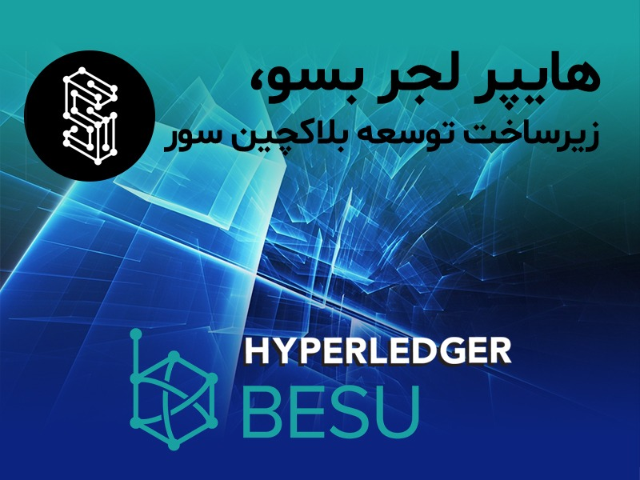
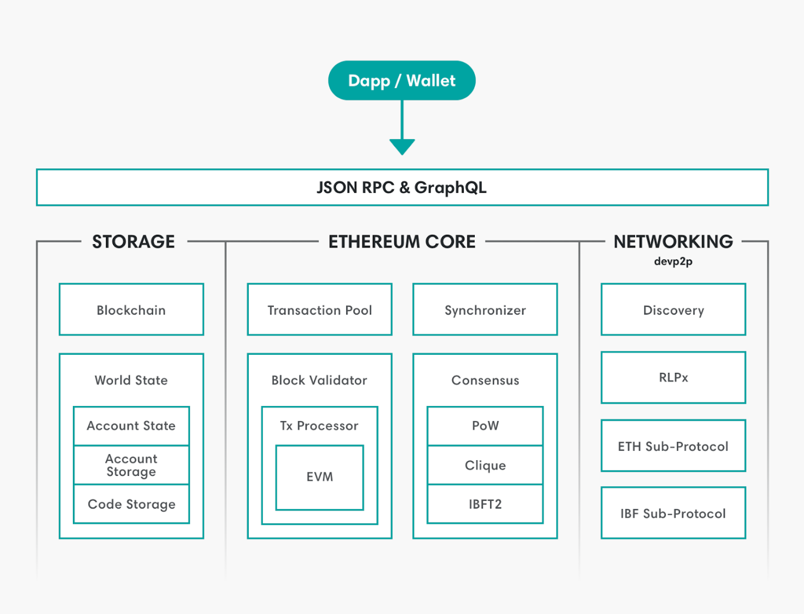

  
# هایپر لجر بسو، زیرساخت توسعه بلاکچین سور

پلتفرم سور بر اساس معماری «هایپرلجربسو»[^1] با تغییراتی در متن برنامه آن بنا شده است. به همین دلیل در مقاله شانزدهم بنیاد سور به موضوع چیستی هایپرلجر بسو پرداختیم.

## مقدمه

هایپرلجر بسو به عنوان یک کلاینت اتریومی مبتنی بر زبان جاوا، اولین پروژه بلاکچینی ثبت شده در هایپرلجر است که می‌تواند بر بستر بلاکچین عمومی فعال باشد. در واقع بسو به واسطه علاقه روز افزون سازمان‌ها به توسعه کاربردهای بلاکچینی بر بسترهای نیازمند به مجوز یا مجوز محور[^2] و عمومی ایجاد شده است. به عبارتی دیگر، در سال‌های اخیر و با شناخت مزایا و معایب بلاکچین‌های مجوز محور و بلاکچین‌های عمومی، نیاز به توسعه برنامه‌های کاربردی مجوز محور و عمومی (ترکیبی و کنسرسیومی) بیش از پیش احساس شد و بسو برای پاسخگویی به این نیاز پا به عرصه گذاشت.

به منظور توسعه هایپرلجر بسو به عنوان یک پلتفرم برای توسعه و استقرار باز (Open development and deployment)، طراحی پروژه بسو و طراحی معماری این پلتفرم با رویکردی ماژولار محور و مبتنی بر اینترفیس‌های دقیق و تمیز توسعه داده شده است. در طراحی سعی شده، بسو تا جای ممکن ماژول محور باشد. به همین منظور بخش مربوط به الگوریتم اجماع، از سایر بخش‌های کلیدی بلاکچین جدا شده است تا هر بخش بتواند به صورت مجزا ارتقا داده شود. با ایجاد واسط‌هایی تمیز میان بخش‌های درون کلاینت (برای نمونه شبکه، بخش ذخیره‌سازی اطلاعات، EVM و مانند آن)، سازمان‌ها می‌توانند بسته به نیاز خود، این زیرساخت را پیکربندی کنند و راهکار خود را با سایر محصولات هایپرلجر نیز یکپارچه کنند.

## هایپرلجر بسو چیست؟

هایپرلجر بسو، یک کلاینت اتریومی منبع باز تحت لیسانس آپاچی 2 است که به زبان جاوا توسعه داده شده است. بسو می‌تواند بر بستر شبکه عمومی اتریوم یا یک شبکه بلاکچینی خصوصی اجرا شود. همچنین بسو توانایی اجراشدن بر شبکه‌های تستی همانند Rivkeby، Ropsten و Gorli را نیز داراست. هایپرلجر بسو شامل چندین الگوریتم اجماع همانند PoW، PoA و IBFT است و برای استفاده در محیط‌های کنسرسیومی، یک نظام جامع مجوزدهی در درون آن توسعه داده شده است.

## کلاینت اتریوم چیست؟

هایپرلجر بسو یکی از چندین کلاینت اتریوم است. یک کلاینت اتریوم، نرم‌افزاری است که پروتکل اتریوم را پیاده‌سازی می‌کند. کلاینت اتریوم شامل موارد زیر است:

- یک محیط اجرایی برای پردازش تراکنش‌ها در بلاکچین اتریوم
- ذخیره سازی ماندگار داده‌های مربوط به اجرای تراکنش
- شبکه‌سازی بی‌واسطه (P2P) برای برقراری ارتباط با سایر نودهای اتریومی فعال در شبکه با هدف هم‌گام‌سازی وضعیت سیستم
- واسط‌های برنامه‌نویسی کاربردی برای توسعه‌دهندگان برنامه‌های کاربردی با هدف برقراری ارتباط با اینترفیس‌های بلاکچین

## ویژگی‌های هایپرلجر بسو چیست؟

هایپرلجز بسو مشخصه‌ها و ویژگی‌های اتحاد اتریوم سازمانی (Enterprise Ethereum Alliance) را پیاده سازی می‌کند. مشخصات اتحاد اتریوم سازمانی (EEA) به منظور ایجاد اینترفیس‌های مشترک در میان پروژه‌های منبع باز و منبع بسته مختلف بر روی شبکه اتریوم منتشر شده اند.

مشخصات هایپرلجر بسو به این شرح است:

- ماشین مجازی اتریوم: ماشین مجازی اتریوم، یک ماشین تورینگ کامل است که از طریق اجرای تراکنش‌های درون بلاکچین اتریوم، امکان توسعه و اجرای قراردادهای هوشمند را فراهم می‌سازد.
- الگوریتم‌های اجماع: هایپرلجر بسو الگوریتم‌های اجماع متنوعی را پیاده‌سازی کرده است. با تغییر این الگوریتم‌ها می‌توان روند صحت‌سنجی تراکنش‌ها، تائید بلوک‌ها و شیوه استخراج بلوک را تغییر داد. الگوریتم‌های اجماع موجود در بسو به این شرح هستند:
  - اثبات صلاحیت (Proof of Authority): هایپرلجر بسو چندین پروتکل اثبات صلاحیت را پیاده‌سازی کرده است. زمانی که اعضای شبکه یکدیگر را می‌شناسند و میزانی از اعتماد در میان آن‌ها است (برای نمونه بلاکچین‌های کنسرسیومی) این الگوریتم اجماع کاربرد دارد. انواع الگوریتم اثبات صلاحیت موجود در بسو بدین شرح هستند:
    - الگوریتم اجماع IBFT 2.0: در شبکه‌های بلاکچینی مبتنی بر IBFT 2.0، تراکنش‌ها و بلوک‌ها توسط حساب‌های تایید شده به نام ولیدیتور (Validator) ارزیابی می‌شوند. ولیدیتورهای موجود در شبکه در زمینه اضافه و حذف شدن سایر ولیدیتورها از طریق رای دهی اعمال نظر می‌کنند. در IBFT 2.0، گره‌ها به سرعت به اجماع رسیده و زمان ثبت بلوک بسیار کم است. در این الگوریتم اجماع احتمال ایجاد فورک یا انشعاب وجود نداشته و تمامی بلوک‌ها در زنجیره اصلی قرار می‌گیرند.
    - الگوریتم اجماع Clique: الگوریتم Clique نسبت به IBFT 2.0، تحمل‌پذیری بیشتری در برابر خطا دارد. در Clique، شبکه می‌تواند حتی در صورت از کارافتادن نیمی از نودهای شبکه، همچنان به فعالیت خود ادامه دهد اما برای فعالیت صحیح، IBFT 2.0 حداقل به فعال بودن دو سوم گره‌ها نیاز دارد. الگوریتم Clique، اجماع فوری ندارد و رسیدن به اجماع در میان گره‌ها به زمان نیاز دارد. بایستی توجه داشت که پیاده‌سازی Clique می‌تواند منجر به ایجاد انشعاب و به سازمان‌دهی مجدد زنجیره شود.
  - اثبات کار (Ethash): این نوع از الگوریتم اجماع اثبات کار برای استخراج تراکنش‌های شبکه اصلی اتریوم مورد استفاده قرار می‌گیرد.
- ذخیره‌سازی (Storage): هایپرلجر بسو برای نگهداری پایدار داده‌های بلاکچین از پایگاه داده RocksDB استفاده می‌کند. در این روش، داده‌ها به دو زیر دسته تقسیم می‌شود:
  - بلاک‌چین: داده‌های بلاکچین شامل سرآیند یا هدر بلوک‌ها، بدنه بلوک که شامل تراکنش‌های موجود در بلوک و رسید تراکنش که شامل متاداده‌هایی مرتبط به تراکنش همانند لاگ‌های تراکنش هستند، است.
  - وضعیت کلی شبکه (World State): هر هدر بلوک، از طریق هش stateRoot به وضعیت کلی شبکه ارجاع می‌دهد. وضعیت کلی شبکه، نگاشتی از آدرس‌ها به حساب‌ها است. حساب‌های خارج از شبکه[^3] شامل موجودی اتری هستند در حالی که حساب قراردادهای هوشمند علاوه بر این شامل کدهای اجرایی‌پذیر و فضای ذخیره‌سازی نیز هستند.
- شبکه‌سازی بی واسطه (P2P Networking): هایپرلجر بسو برای برقراری ارتباط میان کلاینتی، پروتکل شبکه اتریومی devp2p را پیاده کرده است.
- APIهای سمت کاربر: هایپرلجر بسو شبکه اصلی اتریوم و واسط‌های EEA JSON-RPC را از طریق پروتکل‌های HTTP و WebSocket و نیز GraphQLAPI ارائه می‌دهد.
- مانیتورینگ و نظارت: هایپرلجر بسو امکان نظارت بر کارایی شبکه و گره‌ها را فراهم می‌آورد.
  - بر کارایی نود و گره از طریق Prometheus یا متد debug_metrics JSON-RPC API نظارت می‌شود.
  - بر کارآیی شبکه از طریق ابزارهای Alethio همانند Block Explorer و EthStats Network Monitor انجام می‌شود.
- حریم خصوصی: حریم خصوصی در هایپرلجر بسو به امکان ارسال و دریافت خصوصی تراکنش‌ها میان اعضای شبکه اطلاق می‌شود. سایر اعضای شبکه نمی‌توانند به محتوای تراکنش، هویت ارسال‌کننده تراکنش یا طرفین درگیر در تراکنش دست یابند. بسو برای پیاده‌سازی حریم خصوصی از Private Transaction Manager استفاده می‌کند.
- مجوزدهی (Permissioning): یک شبکه مجوزمحور تنها به گره‌ها و حساب‌هایی خاص دارای مجوز می‌توانند در تصمیم‌گیری‌های شبکه حضور داشته باشند.

## هایپرلجر از چه جیزهایی پشتیبانی می‌کند؟

هایپرلجر بسو برای فعال نگهداشتن شبکه، نگهداری از شبکه و نظارت بر گره‌ها در یک شبکه اتریومی، از واسط‌های خط دستور (Command Line Interface) و نیز واسط‌های برنامه‌نویسی کاربردی مبتنی بر HTTP و WebSocjet استفاده می‌کند.

کلاینت بسو از تمامی قابلیت‌های اتریومی همانند قراردادهای هوشمند و توسعه برنامه‌های کاربردی توزیع شده پشتیبانی می‌کند و درضمن تمامی موارد کاربرد قابل تعریف بر روی شبکه اتریوم، در بسو نیز قابل توسعه و استقرار است. ابزارهایی نظیر Truffle، Remix و Web3j این امکانات را در بسو فراهم می‌کنند. استاندارد پیاده‌سازی کلاینت JSON-RPC APIs امکان یکپارچه‌سازی بسو با سایر اجزای اکوسیستم هایپرلجر را تسهیل می‌کند. کلاینت بسو همچنین از ایجاد شبکه‌های کنسرسیومی مجوزمحور خصوصی نیز پشتیبانی می‌کند.

هایپرلجر بسو به دلیل نگرانی‌های امنیتی، از مدیریت کلید در درون کلاینت پشتیبانی نمی‌کند. در عوض، کاربر می‌تواند از EthSigner یا هر ولت سازگار با اتریوم برای مدیریت کلیدهای خصوصی خود استفاده کند. EthSigner دسترسی به کلیدهای کاربر و امضای تراکنش‌ها را از طریق ابزارهایی همانند Vault و Microsoft Azure فراهم می‌کند.

معماری سطح بالای هایپرلجر بسو به شرح زیر است:

[^1]: Hyperledger BESU
[^2]: Permissioned
[^3]: در شبکه اتریوم، هر حسابی که متعلق به قرارداد هوشمند نباشد، حساب خارج از شبکه یا Externally owned account است.

